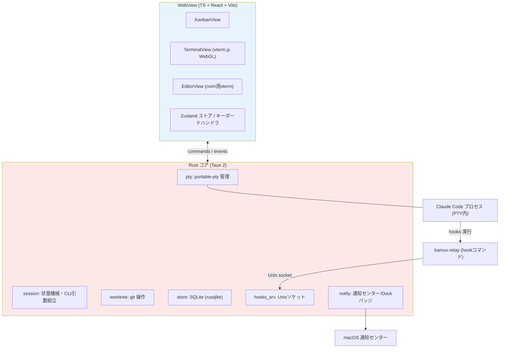
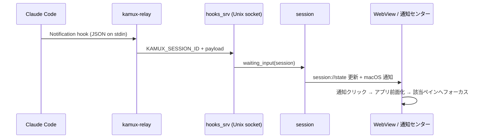

# kamux 設計書 — セッションオーケストレーション・デスクトップアプリ

- 日付: 2026-08-01
- ステータス: 承認済みデザイン（実装計画は writing-plans で別途作成）
- 対象プラットフォーム: macOS のみ
- 技術スタック: Tauri 2（Rust + TypeScript/React + xterm.js）
- アプリ名: `kamux`（仮称。kanban + mux）

## 1. 目的

AI コーディング CLI（Claude Code など）を使った並列開発を、1つの軽量デスクトップアプリで回せるようにする。

- **タスク管理** — カンバン
- **実行監視・対話** — cmux 風ターミナル
- **コード確認・編集** — nvim 統合ビュー

**セッション**とは「タスク（カンバンカード）+ CLI セッション」を統合した概念であり、本アプリの中心モデル。カードを見ればタスクの進捗と CLI の実行状態が同時に分かり、カードをクリックすれば対話中のターミナルペインに直行できる。

## 2. 要件（原文）

1. プロジェクト（リポジトリ）ごとにセッションを複数管理できる
2. セッションとはタスク + Claude Code などの CLI のセッションを統合した概念
3. カンバンでタスクを管理できる
4. カンバンの画面と cmux のターミナルの画面を切り替えられる
5. カンバン上のセッションをクリックするとターミナル画面に切り替わり、該当セッションのペインにフォーカスが当たる
6. ペインで何をしているのかタブを見れば分かる
7. ペイン上のセッションで入力待ちになったり、タスクが完了すると通知が飛ぶ
8. リポジトリ上のコードも閲覧・編集ができる
9. カンバン・cmux のようなターミナル画面・エディタ画面の3種類があり、キーボードで画面を切り替えられる
10. とにかく軽量

## 3. 決定事項

| 論点 | 決定 | 補足 |
|---|---|---|
| アプリ形態 | 全部入り単体アプリ | 既存 cmux は UX の参考のみ。依存しない |
| 対象 CLI | Claude Code 中心 + 汎用 CLI も可 | CC は hooks で確実に検知、汎用はベストエフォート |
| 並列分離 | worktree 選択式 | セッション作成時に「worktree 分離」か「リポ直上」を選ぶ |
| エディタ | nvim 統合 | エディタ画面 = セッションの作業ツリーで nvim を起動済みのターミナルビュー |
| 永続性 | PTY はアプリ内・終了で死んでよい | `claude --resume` で会話を復元。デーモン分離はしない |
| OS | macOS のみ | 通知・キーボード統合を macOS に最適化 |
| スタック | Tauri 2 | メモリ 150〜250MB 級。Chromium 非同梱 |

## 4. スコープ外（YAGNI）

- クロスプラットフォーム対応（Tauri なので将来の余地はあるが、作り込まない）
- セッションのデーモン分離・アプリ終了後の CLI 生存（resume で代替）
- 内蔵 GUI エディタ・LSP（nvim に委譲）
- ターミナルスクロールバックの永続化
- カンバンの WIP 制限・スイムレーン・複数ボード
- チーム共有・リモート同期
- Linear / GitHub Issues 等の外部トラッカー連携

## 5. ドメインモデル

### 5.1 Project（=リポジトリ）

| フィールド | 説明 |
|---|---|
| `id` | 主キー |
| `name` | 表示名 |
| `repo_path` | リポジトリ絶対パス |
| `default_cli` | セッション作成時のデフォルト CLI 種別 |

### 5.2 Session（=タスク + CLI セッション）

| フィールド | 説明 |
|---|---|
| `id` | 主キー |
| `project_id` | 所属プロジェクト |
| `title` / `description` | タスク内容。`title` はタブ名・ブランチ名の元になる |
| `kanban_status` | `backlog / in_progress / review / done`（ユーザー駆動） |
| `sort_order` | カンバン列内の並び順 |
| `mode` | `worktree / in_place` |
| `branch` / `worktree_path` | worktree モード時のみ |
| `cli_kind` | `claude / codex / shell / custom` |
| `cli_command` | custom 時の起動コマンド |
| `claude_session_id` | SessionStart hook で捕捉。`--resume` 用 |
| `last_runtime_state` | 表示復元用ヒント（真実は常に PTY/hooks から導出） |

### 5.3 状態の分離（設計の要）

- **`kanban_status`**（列）: ユーザーのワークフロー状態。手動ドラッグが基本
- **`runtime_state`**（バッジ）: `running / waiting_input / idle / exited / interrupted`。PTY と hooks からシステムが導出（`interrupted` は「前回実行中のままアプリが終了した」状態で、起動時の正規化により付与される。§11 参照）

自動遷移は **「セッション開始時に backlog → in_progress」のみ**。review / done への移動はユーザーの判断。「入力待ち」は列ではなくバッジ（🟡）で表現し、列がバタつかない。

## 6. 画面と UX

### 6.1 3画面とキーマップ

| キー | 動作 |
|---|---|
| `Cmd+1` | カンバン画面 |
| `Cmd+2` | ターミナル画面 |
| `Cmd+3` | エディタ（nvim）画面 |
| `Cmd+P` | プロジェクトスイッチャー |
| `Cmd+N` | 新規セッション作成 |
| `Enter` / クリック（カード上） | ターミナル画面へ切り替え + 該当ペインにフォーカス |
| `Cmd+J / Cmd+K` | ターミナル画面でセッションタブ移動 |

プロジェクトごとに独立したボード + ターミナルワークスペースを持つ。

### 6.2 カンバン画面

- 4列: Backlog / In Progress / Review / Done
- カード表示: タイトル + CLI 種別アイコン + runtime バッジ（🟢 running / 🟡 waiting_input / ⚪ idle / ⛔ exited / ⏸ 中断）
- カード操作: 開始・開く・再開・worktree 掃除・アーカイブ
- DnD: dnd-kit による列間・列内ドラッグ

### 6.3 ターミナル画面（cmux 風）

- 左サイドバー: セッションタブ列。`🟡 fix-login [claude]` のように **タスク名がタブ名**（要件6）
- 右メインエリア: フォーカス中セッションの xterm ペイン
- レイアウト: 1面表示 ⇔ 2分割グリッド（並列エージェントの同時監視用）。分割時は各ペインへ任意のセッションをタブから割り当てる。キーボードフォーカスは常にどちらか一方のペインにあり、`Cmd+J/K` はフォーカス中ペインのセッションを切り替える
- 非表示のセッションも xterm インスタンスは保持（切り替えでスクロールバックが消えない）

### 6.4 エディタ画面

- フォーカス中セッションの作業ツリー（worktree または repo 直上）を cwd に **nvim を起動した専用 PTY**
- セッションごとに遅延起動し、以後はタブ切り替えで維持
- ユーザーの普段の nvim 設定・プラグイン・LSP がそのまま効く

### 6.5 セッション作成フロー

`Cmd+N` → タイトル入力 → worktree 分離の選択（ブランチ名は `session/{title-slug}` を自動提案、編集可）→ CLI 選択 → Backlog にカード生成。「作成して即開始」ボタンで worktree 準備 → PTY 起動 → ターミナル画面へ直行も可。

## 7. アーキテクチャ

### 7.1 プロセス構成

### 7.2 Rust モジュール

| モジュール | 責務 |
|---|---|
| `pty` | PTY spawn / write / resize / kill。読み取りスレッドとバックプレッシャー制御 |
| `session` | セッションライフサイクル状態機械。claude 引数組立（`--settings` 注入、`--resume`）。runtime_state の導出と配信 |
| `worktree` | `git worktree add/remove/list`、ブランチ作成、`.git/info/exclude` 追記 |
| `store` | SQLite DAO（projects / sessions） |
| `hooks_srv` | Unix ソケットで hook イベント受信 → session へ転送 |
| `notify` | macOS 通知（クリックでセッションフォーカスの deep link）、Dock バッジ数 |

### 7.3 フロントエンド

- React + Vite + Zustand（軽量状態管理）
- xterm.js + WebGL アドオン + FitAddon
- dnd-kit（カンバン DnD）
- 1セッション = 最大 2 PTY サーフェス（agent 用 / nvim 用、いずれも遅延起動）

### 7.4 IPC サーフェス

**commands（フロント → Rust）**

`create_project / list_projects / create_session / update_session / start_session / stop_session / resume_session / write_pty / resize_pty / spawn_editor / cleanup_worktree`

**events（Rust → フロント）**

`pty://data/{surface_id}`（出力チャンク）、`pty://exit/{surface_id}`、`session://state/{session_id}`（runtime_state 変化）、`focus://session/{session_id}`（通知クリック起点）

## 8. ターミナルデータフロー

1. PTY 読み取りスレッドがチャンクを読む → Tauri event で WebView へ
2. xterm.js の write コールバックで消化を確認。滞留バイト数が閾値を超えたら PTY 読み取りを一時停止（**バックプレッシャー**。大量出力でも UI が固まらない）
3. リサイズ: FitAddon → `resize_pty` command → PTY へ反映
4. スクロールバックは xterm 側で 10,000 行保持。DB 保存はしない

## 9. 入力待ち・完了検知（要件7）

### 9.1 Claude Code — hooks による確実な検知

アプリが claude 起動時に `--settings <アプリ管理の hooks 設定 JSON>` を渡す。**ユーザーのグローバル/プロジェクト settings.json は変更しない**。

hook コマンドは同梱の小さなリレー `kamux-relay`。PTY spawn 時に注入した環境変数 `KAMUX_SESSION_ID` で自セッションを特定し、stdin の hook JSON を Unix ソケットに転送する。

| Hook | アプリ側の処理 |
|---|---|
| `SessionStart` | payload の `session_id` を DB 保存（`--resume` 用） |
| `Notification` | `waiting_input` へ遷移 🟡 + macOS 通知「入力待ち: {title}」 |
| `Stop` | `idle` へ遷移 + macOS 通知「応答完了: {title}」 |

### 9.2 汎用 CLI — ベストエフォート検知

- BEL 文字（`\x07`）検知 → 注意喚起
- 「出力活動のあと一定時間（既定 30 秒）沈黙 + プロセス生存」→ `idle` 推定
- セッション設定でオン/オフ可。精度限界は UI に明示

### 9.3 通知

- macOS 通知センター（tauri-plugin-notification）+ カード/タブのバッジ + Dock バッジ数（要対応セッション数）
- 通知クリック → アプリ前面化 → ターミナル画面へ切り替え → 該当ペインにフォーカス（要件5と接続）

## 10. worktree 管理

- 配置: `{repo}/.worktrees/{branch}`。初回作成時に `.worktrees/` を `.git/info/exclude` へ自動追記
- ブランチ命名: `session/{title-slug}`（プレフィックスは設定可）
- 作成: `git worktree add {path} -b {branch}`（ベースは現在の HEAD）
- 掃除: カードを Done へ移動 or アーカイブ時に「worktree を削除するか」を提案。未コミット変更があれば必ず確認ダイアログ。ブランチは残す
- リポ直上モード（`in_place`）では git 操作を一切行わない

## 11. 永続化と復帰

- SQLite: `~/Library/Application Support/kamux/app.db`
- 起動時: 前回 running だったセッションは「⏸ 中断」に正規化して表示
- 再開: カードから Enter / 再開ボタン → 同じ作業ツリーで `claude --resume {claude_session_id}`。ID 欠損時は `claude --continue` にフォールバック（worktree モードは cwd が一意なので `--continue` でも正しい会話に当たる）
- shell / custom セッションの再開は「同 cwd で新規プロセス起動」（会話復元なし）

## 12. エラー処理

| 状況 | 挙動 |
|---|---|
| PTY 起動失敗（cwd 消失・バイナリなし） | カードをエラー状態に。stderr をトーストでそのまま表示 |
| worktree 作成失敗（ブランチ重複等） | ダイアログで git の stderr 提示。自動リトライ・force はしない |
| worktree 削除時に未コミット変更 | 確認ダイアログ必須。`--force` はユーザー明示選択のみ |
| hooks 不達（設定不備・ソケット断） | 汎用ヒューリスティックへ自動フォールバック。設定画面に hooks 疎通ステータスを表示 |
| アプリクラッシュ | runtime_state は再起動時に PTY/hooks から再導出。前回 running → 「中断」へ正規化（DB が嘘をつかない） |
| claude バイナリ未検出 | セッション開始時に検出してガイド付きエラー |

## 13. テスト戦略

- **Rust ユニット**: worktree 操作（テンポラリ git リポで実 git 実行）／セッション状態機械／hook JSON パース
- **フロント（vitest）**: ストアロジック（カンバン遷移・フォーカス管理・キーマップ）
- **統合**: **fake-agent スクリプト**（出力を吐き、`kamux-relay` 経由で hook イベントを発火するシェル）で「起動 → 入力待ち → 通知 → 完了 → resume」の全経路を決定的に検証。実 claude はテストに使わない
- E2E GUI 自動化は導入しない。マイルストーンごとの手動スモークチェックリストで代替

## 14. マイルストーン

| | 内容 | ゴール |
|---|---|---|
| **M1 骨格** | Project/Session CRUD・PTY ターミナル（タブ切替）・カンバン（手動 DnD）・`Cmd+1/2` 切替・worktree 作成・claude/shell 起動 | カードから claude が worktree 上で起動し、ターミナルで対話できる |
| **M2 検知と通知** | hooks リレー・runtime バッジ・macOS 通知・通知クリック → ペインフォーカス・resume 復帰 | 放置していても入力待ち・完了が通知で分かる（要件7） |
| **M3 統合完成** | nvim エディタ画面（`Cmd+3`）・2分割グリッド・汎用 CLI ヒューリスティック・worktree 掃除 UX・`Cmd+P` スイッチャー | 要件1〜10 すべて充足 |

## 15. 成功基準（要件10「とにかく軽量」の定量化）

- 起動 1 秒未満
- セッション 5 個表示時にメモリ 300MB 未満
- アイドル時 CPU ほぼ 0%（PTY 出力がないときにポーリングしない設計）

## 16. 参考

- **cmux**（cmux.dev）: ターミナル画面の UX（ワークスペース／ペイン／通知）の参考
- **vibe-kanban**（BloopAI, OSS, Rust+React）: エージェントのカンバン管理 + worktree 運用の実装参考。ただし cmux 風ターミナル・nvim 統合・3画面キーボード UX は kamux 独自
